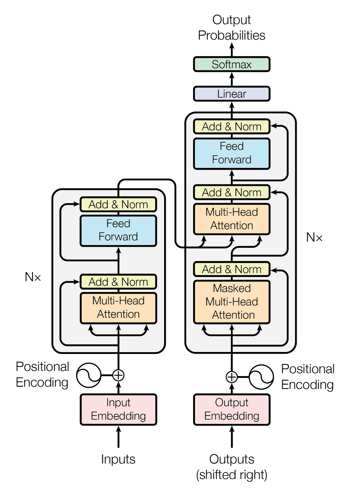

# bidirectional transformers

#### Objective
Learn transformer architecture for language translation by building its components from scratch. 

#### Description
- It performs the language translation from english to italian.
- Taken the opus_books dataset from hugginface for model training.
- Used 12 GiB VRAM, Nvidia Titan XP Foundation Edition GPU.

#### Model Architecture


#### Model Configuration
```
{
    "batch_size": 8,
    "num_epochs": 20,
    "lr": 10**-4,
    "seq_len": 350,
    "d_model": 512,
    "datasource": 'opus_books',
    "lang_src": "en",
    "lang_tgt": "it",
    "model_folder": "weights",
    "model_basename": "tmodel_",
    "preload": "latest",
    "tokenizer_file": "tokenizer_{0}.json",
    "experiment_name": "runs/tmodel"    
}
```

#### Model Accuracy
- BLUE Score:

#### Reference
- [Coding a Transformer from scratch on PyTorch, with full explanation, training and inference.](https://youtu.be/ISNdQcPhsts?si=igjKg8mIHaDV2GsP)
- [Self Attention in Transformer Neural Networks (with Code!)](https://youtu.be/QCJQG4DuHT0?si=fjOBZ0GnUX8tC-ho)
