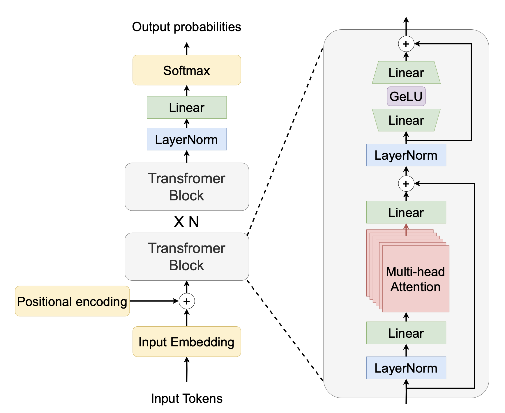

# decoder only transformers

#### Objective
Learn decoder only transformer architecture by building its components from scratch.  

#### Description
- Pre-trained the decoder only model on tiny shakespeare data,[nanoGPT
](https://github.com/karpathy/nanoGPT/tree/master/data).
- Used 12 GiB VRAM, Nvidia Titan XP Foundation Edition GPU.
- Used Greedy and Beam search token predictions techniques.

#### Model Architecture

Ref: https://arxiv.org/pdf/2305.07716

#### Model Configuration
```
{
    "batch_size": 8,
    "num_epochs": 600000,
    "lr": 10**-4,
    "seq_len": 350,
    "d_model": 512,
    "vocab_size": 50304,
    "datasource": 'shakespeare',
    "model_folder": "weights",
    "model_basename": "tmodel_",
    "preload": "latest",
    "tokenizer_file": "tokenizer.json",
    "experiment_name": "runs/tmodel"    
}
```

#### Model Accuracy
- ROUGE Score:

#### Reference
- [Let's build GPT: from scratch, in code, spelled out.](https://youtu.be/kCc8FmEb1nY?si=3Ejl_8xn3ENaQ7NG)
- [Decoder-Only Transformers, ChatGPTs specific Transformer, Clearly Explained!!!](https://youtu.be/bQ5BoolX9Ag?si=BctWcABfAKXx8GuU)