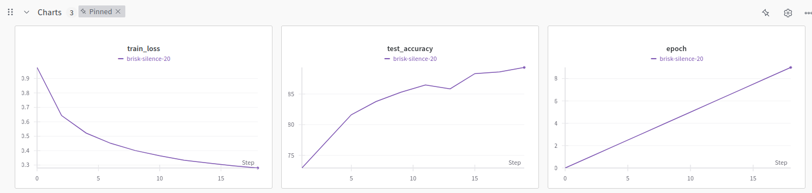

# encoder only transformers (version_1)

#### Objective
- Learn encoder only transformer by building its each component from scratch.
- Use encoder only transformer for classification kind of problem. 

#### Dataset
- AG is a collection of more than 1 million news articles. News articles have been gathered from more than 2000 news sources by ComeToMyHead in more than 1 year of activity. ComeToMyHead is an academic news search engine which has been running since July, 2004. The dataset is provided by the academic comunity for research purposes in data mining (clustering, classification, etc), information retrieval (ranking, search, etc), xml, data compression, data streaming, and any other non-commercial activity. For more information, please refer to the link http://www.di.unipi.it/~gulli/AG_corpus_of_news_articles.html .

- The AG's news topic classification dataset is constructed by Xiang Zhang (xiang.zhang@nyu.edu) from the dataset above. It is used as a text classification benchmark in the following paper: Xiang Zhang, Junbo Zhao, Yann LeCun. Character-level Convolutional Networks for Text Classification. Advances in Neural Information Processing Systems 28 (NIPS 2015).
- It has two columns; fist is label and second is news text:
    ```
    text: a string feature.
    label: a classification label, with possible values including World (0), Sports (1), Business (2), Sci/Tech (3).

    ```
  Example,  
  ``` 
  {
    "label": 3,
    "text": "New iPad released Just like every other September, this one is no different. Apple is planning to release a bigger, heavier, fatter iPad that..."
  }
  ```  
- [fancyzhx/ag_news](https://huggingface.co/datasets/fancyzhx/ag_news)

#### Tokenizer
- Used ```RobertaTokenizerFast``` tokenizer from model, ```roberta-base``` from hugging face.
- It is generally used for text classification plus handling out-of-vocabulary words. 

#### Word Embedding 
- Choices for word embedding

    |Choice|Reason|
    | -------- | -------- |
    |nn.Embedding|Simplicity, train from scratch|
    |GloVe or FastText|Faster training, better generalization, reduces need for large data,may not work well for rare words|
    |BERT-based embeddings|Best accuracy, captures context, better for NLP tasks, heavier computation|
    |FastText or SentencePiece|Dealing with out-of-vocabulary (OOV) words|
- Used Pytorch, nn.Embedding as I trained model from scratch. 

#### Positional Embedding
- Learnable positional encoding is used instead of fixed encoding like sine-cosine based encoding.
- Quick comparision between learnable and fixed position encodings.
    |Feature| Learnable Encoding|Fixed Encoding|
    | -------- | ------- | -------- |
    |Type|Trainable embeddings|Fixed mathematical function|
    |Generalization|Poor for longer sequences|Good for any sequence length|
    |Flexibility|Task-specific adaptation|Fixed for all tasks|
    |Computational Cost|Higher (learns extra parameters)|Lower (precomputed)|
- Used learnable positional encoding.

#### Encoder Module
- Used 6 layers of encoder modules; each module contains 8 multi heads, 256 vector dimension and 128 sequence length for encoder only model architecture.

#### Configuration
- Used ```hydra``` for supporting various configuration templates.

#### Tracking
- Used wandb.
  
